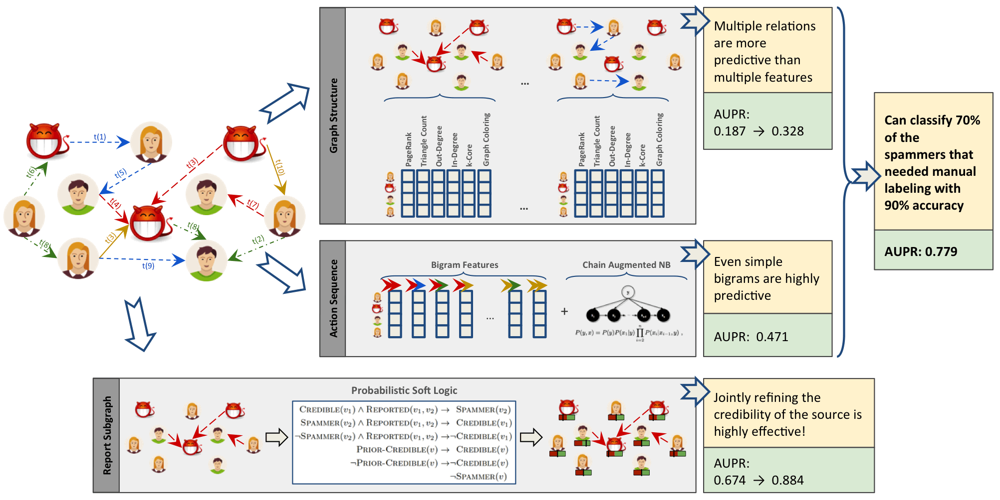

  
__Implementation and data of the experiments in the following paper:__  
  
@inproceedings{fakhraei2015collective,  
 author = {Fakhraei, Shobeir and Foulds, James and Shashanka, Madhusudana and Getoor, Lise},  
 title = {Collective Spammer Detection in Evolving Multi-Relational Social Networks},  
 booktitle = {Proceedings of the 21th ACM SIGKDD International Conference on Knowledge Discovery and Data Mining},  
 series = {KDD '15},  
 year = {2015},  
 isbn = {978-1-4503-3664-2},  
 location = {Sydney, NSW, Australia},  
 pages = {1769--1778},  
 doi = {10.1145/2783258.2788606},  
 publisher = {ACM},  
}   
  
__Folders:__  
_code:_ Python code (and iPython notebook versions) for computing graph and sequence features and classification, and exporting data for PSL.  
_data:_ Placeholder for dataset please download the dataset from https://obj.umiacs.umd.edu/tagged_social_spam/index.html  
_output:_ Placeholder for the features and predictions.  
  
__Dependencies:__  
_Graphlab Create:_ https://dato.com/products/create/  
_NumPy:_ http://www.numpy.org/  
_scikit-learn:_ http://scikit-learn.org/stable/  
  
__A copy of the paper can be found here:__  
http://linqs.cs.umd.edu/basilic/web/Publications/2015/fakhraei:kdd15/  